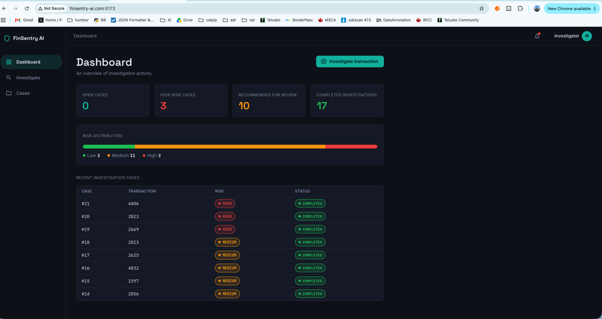
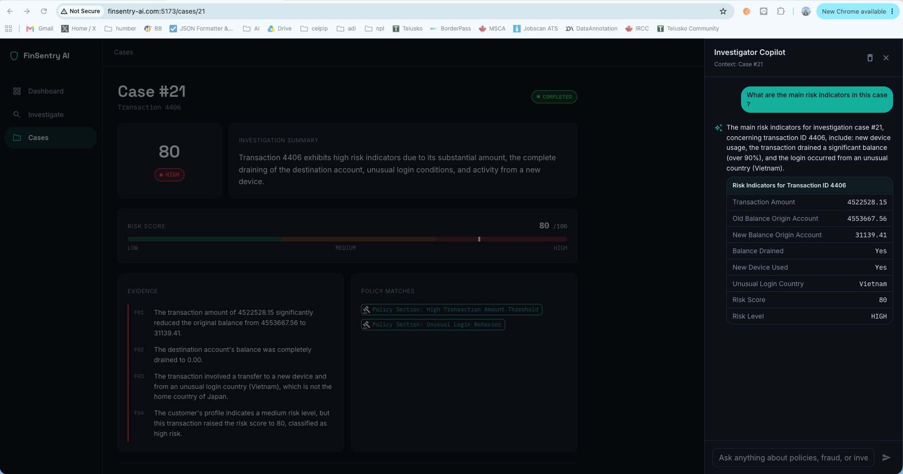
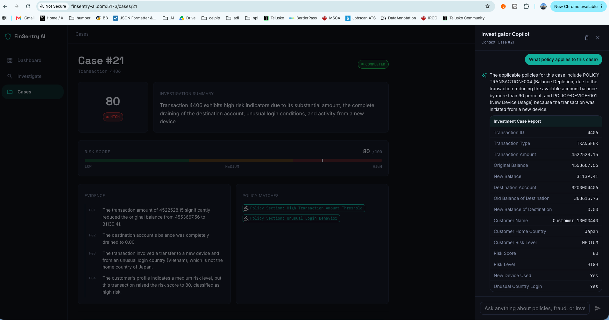
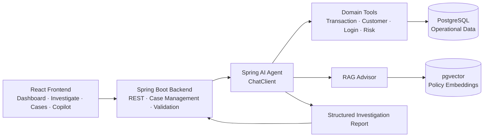

<div align="center">

#  FinSentry AI

### Agentic Financial Transaction Investigation Platform

<p>
  
  
  
  
  
  
</p>

**Evidence first · Policy grounded · Human decided**

</div>

---

> [!NOTE]
> **FinSentry AI is an AI-powered investigation assistant for financial institutions.**  
> It helps investigators gather evidence, calculate transparent risk indicators, retrieve relevant policy guidance, and generate structured investigation reports.  
> **It does not autonomously declare fraud, freeze accounts, or replace an authorized human investigator.**

---

## ✨ Key Features

<table>
<tr>
<td width="50%" valign="top">

### 🤖 Agentic AI with Tool Calling
The AI agent can call domain tools to retrieve transaction, customer, login, and risk data instead of relying on prompt context alone.

### 🧮 Deterministic Risk Scoring
Risk indicators are calculated in Java using explicit rules so the numerical assessment remains reproducible and explainable.

### 📚 Policy Retrieval with RAG
Relevant investigation policy is retrieved from a vector store and supplied to the model as grounded context.

</td>
<td width="50%" valign="top">

### 📄 Structured Investigation Reports
The agent produces a structured report containing risk level, risk score, evidence, policy matches, and a recommended next step.

### 👤 Human-in-the-Loop
Final enforcement decisions remain with authorized investigators. FinSentry is decision support, not autonomous enforcement.

### 💬 Investigator Copilot
Investigators can ask contextual questions about a case, risk indicators, customer activity, and applicable policy in natural language.

</td>
</tr>
</table>

---

# 🖥️ Product Walkthrough

<table>
<tr>
<td width="50%" valign="top">

## 1 · Investigation Dashboard

Overview of investigation activity, completed cases, risk distribution, and recent investigations.



</td>
<td width="50%" valign="top">

## 2 · Investigation Report

A structured case view showing the generated risk score, evidence, matched policy, and recommended investigator action.


</td>
</tr>
<tr>
<td width="50%" valign="top">

## 3 · Investigator Copilot

The Copilot can query the same domain tools used by the investigation agent and surface current risk indicators for the active case.



</td>
<td width="50%" valign="top">

## 4 · Policy-Grounded Q&A

The Copilot can retrieve policy context through RAG and connect relevant rules to the evidence available for a case.



</td>
</tr>
</table>

---

# 🏗️ Architecture Overview



The LLM is responsible for **tool selection, synthesis, and explanation**.  
Risk calculations remain deterministic Java logic rather than model-generated arithmetic.

---

# 🔎 Investigation Flow

```text
Transaction ID
     │
     ▼
Create Investigation Case
     │
     ▼
Retrieve transaction data
     │
     ▼
Agent selects investigation tools
     │
     ├── TransactionTools
     ├── CustomerTools
     ├── LoginTool
     └── RiskTools
     │
     ▼
Retrieve relevant policy context with RAG
     │
     ▼
Generate structured investigation report
     │
     ▼
Persist case + report
     │
     ▼
Human investigator reviews recommendation
```

Case execution lifecycle:

```text
PENDING → IN_PROGRESS → COMPLETED
                      ↘ FAILED
```

> `COMPLETED` means the AI investigation finished and the report was persisted.  
> It does **not** mean the human investigator has closed the case.

---

# 🧠 Risk Assessment

FinSentry currently evaluates transparent, deterministic indicators such as:

- unusual transaction amount
- new or unrecognized device
- unusual login country
- rapid transaction activity
- severe balance depletion

The individual indicators contribute to an aggregate score, which is mapped to:

| Risk level | Meaning |
|---|---|
| 🟢 `LOW` | No significant indicators |
| 🟠 `MEDIUM` | Review-worthy anomalies |
| 🔴 `HIGH` | Multiple or severe indicators |

The available recommendations are intentionally constrained to:

```text
NO_ACTION
REVIEW
ESCALATE_FOR_MANUAL_REVIEW
```

---

> [!IMPORTANT]
> ### 💡 Design Limitation & Next Refinement
>
> **Currently, recommendations are derived primarily from the aggregate risk score.**
>
> A natural next refinement would be to introduce **policy-specific escalation triggers**. For example, certain high-confidence combinations such as **new device + unusual country** could warrant escalation independently of the aggregate score.
>
> This is intentionally **not hardcoded arbitrarily** in the prototype. In a production financial system, thresholds, signal combinations, and escalation rules should be calibrated with domain input from experienced fraud/risk analysts, validated against institutional policy and historical outcomes, and monitored for false positives and missed risk.

<table>
<tr>
<td width="46%" align="center">

### Current Prototype

```text
Risk Indicators
      ↓
Aggregate Risk Score
      ↓
Risk Level
      ↓
Recommendation
```

</td>
<td width="8%" align="center">

# → 

</td>
<td width="46%" align="center">

### Potential Production Refinement

```text
Risk Indicators ───────────┐
                           ├─→ Policy-aware decision layer
Aggregate Risk Score ──────┤
                           │
Policy-specific triggers ──┘
             ↓
      Recommendation
```

</td>
</tr>
</table>

---

# 📚 Policy Retrieval with RAG

FinSentry includes a **synthetic fraud and compliance investigation policy** for demonstration purposes.

At startup, the application:

1. loads the policy PDF
2. splits the document into chunks
3. generates embeddings
4. stores them in pgvector
5. retrieves relevant chunks through Spring AI RAG during investigations and Copilot conversations

This keeps policy-oriented responses grounded in retrieved context instead of relying only on general model knowledge.

> [!CAUTION]
> The bundled policy is synthetic and is used only for this portfolio/demo project. It is **not** an institutional or regulatory policy.

---

# 💬 Investigator Copilot

Example questions:

```text
What are the main risk indicators in this case?

What policy applies to this case?

Show the recent login activity for this customer.

Is this login country unusual for the customer?

What evidence is still missing?

Should we freeze this customer's account?
```

For enforcement questions, the Copilot is constrained from making or authorizing the final decision. It can provide evidence and recommend a review path, but the action remains with an authorized human investigator.

---

# 🗃️ Data

The transaction layer uses the **PaySim synthetic mobile-money transaction dataset** as the base transaction source.

Because PaySim is transaction-focused, selected demo cases are supplemented with synthetic investigation context:

- customer profile
- home country
- device information
- login history
- investigation cases
- persisted investigation reports

The PaySim `isFraud` label is **not exposed to the AI during investigation**. It can instead be reserved as ground truth for offline evaluation.

> The full PaySim dataset should not be committed to this repository. Use the original dataset source or small demo/sample data.

---

## 🧪 Selecting Transactions for Testing

FinSentry uses the PaySim dataset as its underlying transaction source. To make manual testing easier, known fraudulent transactions can be selected using the dataset's ground-truth `is_fraud` label.

The following query returns fraudulent transactions that also have the synthetic customer, login, and device context required for a richer FinSentry investigation:

```sql
SELECT
    t.id,
    t.amount,
    t.oldbalance_org,
    t.newbalance_orig,
    l.country AS login_country,
    c.home_country,
    d.trusted
FROM transactions t
JOIN customers c
    ON c.customer_id = t.name_orig
JOIN login_history l
    ON l.transaction_id = t.id
JOIN devices d
    ON d.device_id = l.device_id
WHERE t.is_fraud = TRUE
ORDER BY t.amount DESC
LIMIT 20;
```

Choose any returned `id` and enter it as the **Transaction ID** on the Investigate page.

> [!IMPORTANT]
> ### Ground-truth isolation
> The `is_fraud` field is used **only for test-case selection and offline evaluation**. It is not exposed to the investigation agent, risk-scoring tools, RAG pipeline, or Investigator Copilot during an investigation.
>
> FinSentry must therefore reach its assessment using only the evidence available to an investigator — such as transaction behavior, customer context, device information, login activity, calculated risk indicators, and retrieved policy guidance.

This separation allows the system's recommendations to later be compared against the PaySim ground truth without leaking the expected outcome into the investigation process.


# 🧰 Tech Stack

<table>
<tr>
<td width="33%" valign="top">

### Backend
- Java 21
- Spring Boot 4.0.8
- Spring AI 2.0.0
- Spring Web MVC
- Spring Data JPA
- Maven

</td>
<td width="33%" valign="top">

### AI & Data
- OpenAI chat model
- OpenAI embeddings
- Spring AI Tool Calling
- Spring AI RAG
- PostgreSQL 17
- pgvector

</td>
<td width="33%" valign="top">

### Frontend & Infra
- React 18
- Vite
- Material UI
- Axios
- Docker Compose
- pgAdmin

</td>
</tr>
</table>

---

# 📁 Project Structure

```text
finsentry-ai/
├── backend/
│   ├── src/main/java/com/finsentry/finsentry_ai/
│   │   ├── ai/
│   │   ├── config/
│   │   ├── controller/
│   │   ├── entity/
│   │   ├── rag/
│   │   ├── repository/
│   │   ├── service/
│   │   └── tool/
│   ├── src/main/resources/
│   └── pom.xml
│
├── frontend/
│   ├── src/
│   ├── package.json
│   └── vite.config.js
│
├── docs/
│   └── images/
│
└── README.md
```

---

# 🚀 Getting Started

### 1. Start PostgreSQL + pgvector

```bash
cd backend
docker compose up -d
```

### 2. Configure the OpenAI API key

```bash
export OPENAI_API_KEY="your-api-key"
```

```properties
spring.ai.openai.api-key=${OPENAI_API_KEY}
```

> Never commit API keys or local secrets to source control.

### 3. Start the backend

```bash
cd backend
./mvnw spring-boot:run
```

Backend:

```text
http://localhost:8080
```

### 4. Start the frontend

```bash
cd frontend
npm install
npm run dev
```

Frontend:

```text
http://localhost:5173
```

---

# 🛡️ Responsible AI Boundaries

FinSentry is designed as **investigation support**, not autonomous fraud enforcement.

### FinSentry may
- retrieve evidence
- calculate risk indicators
- retrieve policy context
- explain findings
- recommend review or escalation

### FinSentry must not
- declare a customer fraudulent
- autonomously freeze or block an account
- reverse transactions
- fabricate missing evidence
- replace an authorized human investigator

---

# 🔭 Future Improvements

- policy-specific escalation triggers calibrated with fraud-domain experts
- richer evidence provenance and policy citations
- `confirmed / relevant / insufficient-evidence` policy matching
- offline evaluation against hidden PaySim ground truth
- recommendation-quality and hallucination metrics
- analyst decision capture and audit trail
- MCP exposure of selected investigation tools
- production authentication, authorization, observability, and deployment hardening

---

# ⚠️ Disclaimer

FinSentry AI is a **portfolio and educational prototype** built with synthetic/de-identified data and synthetic policy material. It is not a production banking system and should not be used to make real financial, fraud, compliance, or enforcement decisions.

---

<div align="center">

### FinSentry AI

**Evidence first · Policy grounded · Human decided**

</div>
