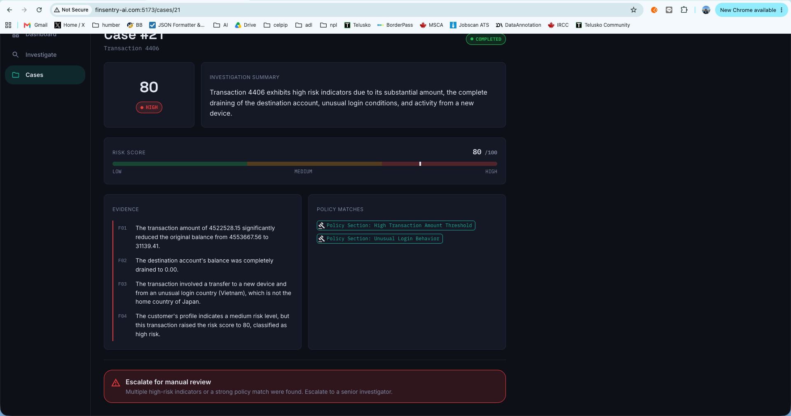

<div align="center">

# 🛡️ FinSentry AI

### Agentic Financial Transaction Investigation Platform

**Java · Spring Boot · Spring AI · Tool Calling · RAG · PostgreSQL/pgvector · React**

FinSentry AI is a human-in-the-loop investigation assistant that helps financial investigators gather evidence, evaluate deterministic risk indicators, consult internal policy, and produce structured investigation reports.

**It assists investigation — it does not autonomously declare fraud, freeze accounts, or replace an authorized investigator.**

</div>

---

## ✨ Overview

Fraud investigation often requires analysts to move between transaction records, customer profiles, login history, risk rules, and policy documents. FinSentry AI brings those signals together behind a single investigation workflow.

Given a transaction ID, the system can:

- retrieve transaction and customer context through **Spring AI Tool Calling**
- inspect recent transaction and login activity
- calculate **deterministic, explainable risk indicators**
- retrieve relevant investigation policies using **RAG + pgvector**
- generate a structured investigation report with evidence and policy matches
- recommend `NO_ACTION`, `REVIEW`, or `ESCALATE_FOR_MANUAL_REVIEW`
- let investigators continue exploring the case through an **Investigator Copilot**

> **Human-in-the-loop by design:** FinSentry provides evidence and recommendations. Final enforcement or account decisions remain with authorized human investigators.

---

## 📸 Product Preview

### Investigation Dashboard

A consolidated view of investigation activity, risk distribution, and recent cases.


### Structured Investigation Report

Each completed investigation preserves its risk score, evidence, policy matches, and recommended next step.



### Investigator Copilot — Evidence & Risk Exploration

The Copilot can use the same internal tools to answer contextual questions about a case and surface the underlying risk indicators.


### Policy-Grounded Investigation Support

The Copilot can retrieve relevant policy guidance through RAG and connect it to the evidence available for the current case.


---

## 🧠 What Makes It Agentic?

FinSentry does more than send a transaction to an LLM.

The model is given access to a set of read-only investigation tools and can decide which information it needs to answer an investigation question.

```text
Investigator
     │
     ▼
React Investigation Console
     │
     ▼
Spring Boot REST API
     │
     ▼
Spring AI Investigation Agent / Copilot
     │
     ├──────── Tool Calling ────────┐
     │                              │
     │   • TransactionTools         │
     │   • CustomerTools            ▼
     │   • LoginTool           PostgreSQL
     │   • RiskTools
     │
     └──────── RAG ─────────────────┐
                                    ▼
                         Policy PDF → pgvector
                                    │
                                    ▼
                         Grounded AI Response
                                    │
                                    ▼
                    Structured Investigation Report
```

The LLM is responsible for orchestration, synthesis, and explanation. Numerical risk indicators are calculated in Java rather than delegated to the model.

---

## 🔍 Investigation Workflow

```text
Transaction ID
     ↓
Create Investigation Case
     ↓
Retrieve Transaction
     ↓
Agent selects investigation tools
     ↓
Transaction + Customer + Login + Risk Evidence
     ↓
Retrieve relevant policy context (RAG)
     ↓
Generate structured report
     ↓
Persist case + report
     ↓
Human investigator reviews recommendation
```

Case execution follows a simple lifecycle:

```text
PENDING → IN_PROGRESS → COMPLETED
                      ↘ FAILED
```

`COMPLETED` means the AI investigation finished and the report was persisted. It does **not** mean a human investigator has closed the case.

---

## 🧰 Core AI Capabilities

| Capability | Implementation |
|---|---|
| Agent orchestration | Spring AI `ChatClient` |
| Tool Calling | Spring AI `@Tool` methods |
| Transaction evidence | `TransactionTools` |
| Customer context | `CustomerTools` |
| Login history | `LoginTool` |
| Risk calculation | `RiskTools` + deterministic Java rules |
| Policy retrieval | Spring AI RAG |
| Vector search | PostgreSQL + pgvector |
| Structured output | AI response mapped to investigation report DTO |
| Copilot | Context-aware investigation Q&A |
| Human oversight | Restricted recommendations; no autonomous enforcement |

---

## 🧮 Explainable Risk Scoring

Risk scoring is intentionally deterministic and implemented in Java. This keeps the numerical assessment inspectable and reproducible instead of asking the LLM to invent a score.

Current indicators include:

- amount anomaly relative to available transaction history
- new/unrecognized device usage
- unusual login country
- rapid transaction activity
- severe balance depletion

The resulting score is mapped to `LOW`, `MEDIUM`, or `HIGH` risk and is surfaced alongside the underlying evidence.

### Design limitation & next refinement

**Currently, recommendations are derived primarily from the aggregate risk score.** A natural next refinement would be to introduce **policy-specific escalation triggers**. For example, certain high-confidence combinations such as **new device + unusual country** could warrant escalation independently of the aggregate score.

This is intentionally **not hardcoded arbitrarily** in the prototype. In a production financial system, the thresholds, signal combinations, and escalation rules should be calibrated with domain input from experienced fraud/risk analysts, validated against institutional policy and historical outcomes, and monitored for false positives and missed risk.

This separation is deliberate:

```text
Current prototype
Risk indicators → Aggregate score → Risk level → Recommendation

Potential production refinement
Risk indicators ────────────────┐
                                ├→ Policy-aware decision layer → Recommendation
Aggregate score ────────────────┤
                                │
High-confidence policy triggers ┘
```

---

## 📚 Policy Retrieval with RAG

FinSentry includes a **synthetic fraud & compliance investigation policy** for demonstration purposes.

At application startup, the policy document is:

1. loaded from PDF
2. split into chunks
3. embedded
4. stored in pgvector
5. retrieved through Spring AI's RAG advisor when relevant

This lets the agent ground investigation explanations in policy context instead of relying only on general model knowledge.

> The bundled policy is synthetic and exists solely for this portfolio/demo project. It is not an institutional or regulatory policy.

---

## 💬 Investigator Copilot

The Copilot is a read-only investigation assistant available in the case workspace.

Example questions:

```text
What are the main risk indicators in this case?

What policy applies to this case?

Show the recent login activity for this customer.

Has this customer used a new device?

Why is this transaction unusual?

What evidence is still missing?

Should we freeze this customer's account?
```

For enforcement questions, FinSentry is explicitly constrained from making or authorizing the final decision. It can surface evidence and recommend review/escalation, but the action remains with an authorized investigator.

---

## 🗃️ Data

The transaction layer uses the **PaySim synthetic mobile-money transaction dataset** as the base transaction source.

Because PaySim is transaction-focused, FinSentry supplements selected demo cases with **synthetic investigation context**, including:

- customer profile and home country
- device information
- login history
- investigation cases and reports

The original PaySim fraud label is **not exposed to the AI during investigation**. It can instead be reserved as ground truth for offline evaluation.

> The full PaySim dataset is not intended to be committed to this repository. Reproduce it from the original dataset source or use small demo/sample data.

---

## 🏗️ Project Structure

```text
finsentry-ai-project/
├── backend/
│   ├── src/main/java/com/finsentry/finsentry_ai/
│   │   ├── ai/
│   │   │   ├── agent/
│   │   │   └── validator/
│   │   ├── config/
│   │   ├── controller/
│   │   ├── entity/
│   │   ├── rag/
│   │   ├── repository/
│   │   ├── service/
│   │   └── tool/
│   ├── src/main/resources/
│   │   ├── data/
│   │   └── application.properties
│   ├── docker-compose.yml
│   └── pom.xml
│
├── frontend/
│   ├── src/
│   ├── package.json
│   └── vite.config.js
│
└── docs/
    └── images/
```

---

## ⚙️ Tech Stack

### Backend
- Java 21
- Spring Boot 4.0.8
- Spring AI 2.0.0
- Spring Web MVC
- Spring Data JPA
- PostgreSQL 17
- pgvector
- Maven

### AI
- OpenAI chat model
- OpenAI embeddings
- Spring AI Tool Calling
- Spring AI RAG
- PDF document ingestion
- Structured AI output

### Frontend
- React 18
- Vite
- Material UI
- Axios
- React Router

### Infrastructure
- Docker Compose
- PostgreSQL / pgvector
- pgAdmin

---

## 🚀 Running Locally

### Prerequisites

- Java 21+
- Maven
- Node.js / npm
- Docker

### 1. Start PostgreSQL + pgvector

```bash
cd backend
docker compose up -d
```

Default local database:

```text
Database: finsentry
User:     finsentry
Port:     5432
```

### 2. Configure the OpenAI API key

Do **not** commit API keys to source control.

```bash
export OPENAI_API_KEY="your-api-key"
```

Configure Spring to read the key from the environment, for example:

```properties
spring.ai.openai.api-key=${OPENAI_API_KEY}
```

### 3. Start the backend

```bash
cd backend
./mvnw spring-boot:run
```

Backend:

```text
http://localhost:8080
```

### 4. Start the frontend

```bash
cd frontend
npm install
npm run dev
```

Frontend:

```text
http://localhost:5173
```

---

## 🧪 Example Investigation

```http
POST /api/investigations
Content-Type: application/json
```

```json
{
  "transactionId": 4406
}
```

A completed investigation can contain:

```json
{
  "riskLevel": "HIGH",
  "riskScore": 80,
  "findings": [
    "Significant balance depletion was observed.",
    "A new device was used.",
    "The login country differs from the customer's home country."
  ],
  "recommendation": "ESCALATE_FOR_MANUAL_REVIEW"
}
```

The generated report is persisted as an investigation snapshot and can then be explored through the Investigator Copilot.

---

## 🛡️ Responsible AI Boundaries

FinSentry is designed as **decision support**, not an autonomous fraud enforcement system.

The assistant must not:

- declare that a customer is fraudulent
- autonomously freeze or block an account
- reverse transactions
- take enforcement actions
- fabricate missing evidence

Instead, it should:

- retrieve available evidence
- expose deterministic risk indicators
- distinguish evidence from inference
- ground policy explanations in retrieved context
- communicate missing information
- recommend an appropriate human review path

---

## 🔭 Future Improvements

- policy-specific escalation triggers calibrated with fraud-domain experts
- richer evidence provenance and policy citations
- explicit `confirmed / relevant / insufficient-evidence` policy matching
- offline evaluation against hidden PaySim ground truth
- recommendation-quality and hallucination metrics
- investigation audit trail and analyst decision capture
- MCP-based exposure of selected investigation tools
- production authentication, authorization, observability, and deployment hardening

---

## ⚠️ Disclaimer

FinSentry AI is a **portfolio and educational prototype** built with synthetic/de-identified data and synthetic policy material. It is not a production banking system and should not be used to make real financial, fraud, compliance, or enforcement decisions.

---

<div align="center">

**FinSentry AI**  
*Evidence first. Policy grounded. Human decided.*

</div>
